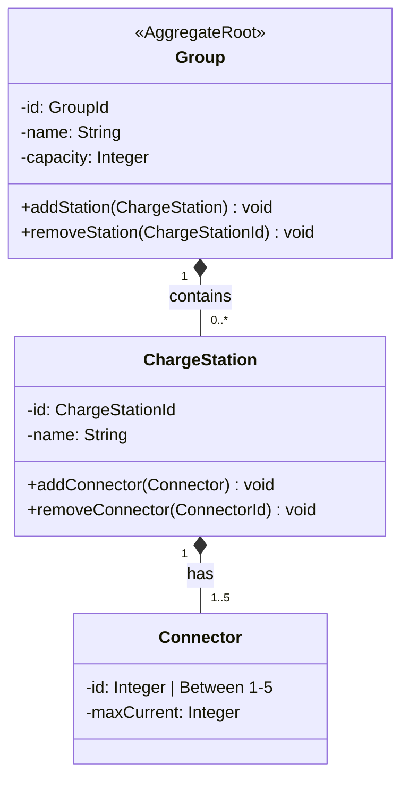
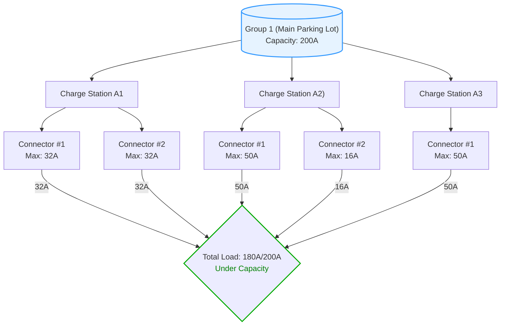

# ⚡From Crud To DDD

> 💡 A practical api sample based on `Vertical Slice Architecture`, `DDD`, `Minimal APIs` and `.Net 9`.

> [!NOTE]
> This project involves migrating a [existing CRUD-based](https://github.com/mehdihadeli/from-crud-to-ddd/tree/without-ddd) application architecture to a more robust and maintainable [Domain-Driven Design (DDD) approach](https://github.com/mehdihadeli/from-crud-to-ddd/). The goal is to better align the codebase with business logic, improve scalability, and enhance long-term maintainability.

To ensure a smooth and isolated transition, the migration has been organized into [two separate Git branches](https://github.com/mehdihadeli/from-crud-to-ddd/branches).

## Table of Contents

- [⚡From Crud To DDD](#from-crud-to-ddd)
  - [Table of Contents](#table-of-contents)
  - [Features](#features)
  - [Libraries](#libraries)
  - [Getting Started](#getting-started)
    - [1. Install .NET Core 9.0](#1-install-net-core-90)
    - [2. Install an IDE](#2-install-an-ide)
    - [3. Install `make`](#3-install-make)
    - [4. Set up and Start the Infrastructure](#4-set-up-and-start-the-infrastructure)
    - [5. Open the Solution](#5-open-the-solution)
    - [6. Run and Debug the Project](#6-run-and-debug-the-project)
      - [Using IDE](#using-ide)
      - [Using Make Commands](#using-make-commands)
      - [Using .NET Aspire](#using-net-aspire)
    - [7. Host the Application](#7-host-the-application)
    - [8. Running Tests](#8-running-tests)
  - [Application Structure](#application-structure)
    - [Folder Structure](#folder-structure)
  - [Domain Model](#domain-model)
    - [Diagram](#diagram)
      - [1. Group → ChargeStation Relationship](#1-group--chargestation-relationship)
      - [2. ChargeStation → Connector Relationship](#2-chargestation--connector-relationship)
    - [Entities](#entities)
      - [Group](#group)
      - [Charge Station](#charge-station)
      - [Connector](#connector)
    - [Business Rules](#business-rules)
    - [Building and Running the Application](#building-and-running-the-application)

## Features

- ✅ Using `Vertical Slice Architecture` as a high-level architecture
- ✅ Using `Domain Driven Design` to handle complex business logics
- ✅ Using `UnitTests` and `NSubstitute` for mocking dependencies
- ✅ Using `Minimal APIs` for handling requests
- ✅ Using the different type of tests like `Unit Tests`, `Integration Tests`, `End-To-End Tests`
- ✅ Using `OpenTelemetry` for collecting `Logs`, `Metrics` and `Distributed Traces`
- ✅ Using `.NET Aspire` for cloud-native application orchestration and enhanced developer experience

## Libraries

- ✔️ **[`.NET 9`](https://dotnet.microsoft.com/download)** - .NET Framework and .NET Core, including ASP.NET and ASP.NET Core
- ✔️ **[`Asp.Versioning`](https://github.com/dotnet/aspnet-api-versioning)** - A set of libraries for ASP.NET Core to manage API versioning
- ✔️ **[`Microsoft.AspNetCore.OpenApi`](https://www.nuget.org/packages/Microsoft.AspNetCore.OpenApi)** - .NET 9 Built-in OpenAPI support for ASP.NET Core
- ✔️ **[`Microsoft.EntityFrameworkCore.Sqlite`](https://learn.microsoft.com/en-us/ef/core/providers/sqlite/?tabs=dotnet-core-cli)** - Entity Framework Core provider for SQLite
  extensions.
- ✔️ **[`Aspire`](https://github.com/dotnet/aspire)** - .NET stack for building and orchestrating observable, distributed cloud-native applications.
- ✔️ **[`Respawn`](https://github.com/jbogard/Respawn)** - Library to reset database state for integration testing scenarios
- ✔️ **[`Testcontainers.PostgreSql`](https://github.com/testcontainers/testcontainers-dotnet)** - Integration testing with lightweight PostgreSQL containers
- ✔️ **[`EFCore.NamingConventions`](https://github.com/efcore/EFCore.NamingConventions)** - A plugin that enforces specific naming conventions in Entity Framework Core
- ✔️ **[`Npgsql.EntityFrameworkCore.PostgreSQL`](https://github.com/npgsql/efcore.pg)** - Entity Framework Core provider for PostgreSQL by Npgsql
- ✔️ **[`Swashbuckle.AspNetCore.SwaggerUI`](https://github.com/domaindrivendev/Swashbuckle.AspNetCore)** - Provides a Swagger UI implementation for ASP.NET Core
- ✔️ **[`Scalar.AspNetCore`](https://github.com/scalar/scalar/blob/main/integrations/aspnetcore/README.md)** - Provides additional OpenAPI/Swagger-related features
- ✔️ **[`Humanizer.Core`](https://github.com/Humanizr/Humanizer)** - A library for working with strings, dates, numbers, and times in a more human-readable way
- ✔️ **[`Scrutor`](https://github.com/khellang/Scrutor)** - Extensions for Microsoft.Extensions.DependencyInjection to allow easy assembly scanning
- ✔️ **[`xUnit`](https://xunit.net/)** - Popular testing framework for .NET applications
- ✔️ **[`Bogus`](https://github.com/bchavez/Bogus)** - A powerful .NET library for generating fake data
- ✔️ **[`Shouldly`](https://github.com/shouldly/shouldly)** - Simple and human-readable assertions for .NET tests
- ✔️ **[`NSubstitute`](https://github.com/nsubstitute/NSubstitute)** - A friendly .NET library for creating substitutes to use in testing

## Getting Started

Follow this guide to set up and run the project on your development environment.

### 1. Install .NET Core 9.0

Download and install the latest version of .NET Core 9.0 SDK from the official [.NET download page](https://dotnet.microsoft.com/download).

Ensure `dotnet` is available in your terminal or command prompt by running:

```bash
dotnet --version
```

### 2. Install an IDE

You can use any of the following IDEs for development:

- **[JetBrains Rider](https://www.jetbrains.com/rider/)** (Recommended)
- **[Visual Studio 2022](https://visualstudio.microsoft.com/)**
- **[Visual Studio Code](https://code.visualstudio.com/)**

Ensure the IDE includes support for .NET Core and plugins for C#.

### 3. Install `make`

The project uses a `Makefile` for common tasks. Install `make` for your platform:

- **Windows**: Use [Chocolatey](https://chocolatey.org/install) or other package managers:

```bash
choco install make
```

- **MacOS**: Install via Homebrew:

```bash
brew install make
```

- **Linux**: Install with apt or your distribution's package manager:

```bash
sudo apt install make
```

Test `make` installation by running:

```bash
make --version
```

### 4. Set up and Start the Infrastructure

This project uses a PostgreSQL database running in a Docker container. Start the infrastructure using `make`:

```bash
# Start docker-compose
make run-docker-compose

# Stop docker-compose
make stop-docker-compose
```

This command will run the PostgreSQL docker container using docker-compose. Ensure Docker is installed and running on your machine.

### 5. Open the Solution

Open the solution file [SmartChargingApplication.slnx](./SmartChargingApplication.slnx) in your preferred IDE (e.g., Rider or Visual Studio).

Project structure:

- **`src/`**: Contains the main project code.
- **`tests/`**: Contains test projects (Unit, Integration, and End-to-End tests).

### 6. Run and Debug the Project

There are multiple ways to run the project:

#### Using IDE

- Open the solution [SmartChargingApplication.slnx](./SmartChargingApplication.slnx) in your IDE (e.g., Rider or Visual Studio).
- Run or debug the project directly within the IDE.

#### Using Make Commands

Alternatively, you can use the terminal commands below to build, run, or test the project:

- Run the project:

```bash
make run
```

- Run all tests:

```bash
make test
```

#### Using .NET Aspire

Install the [`Aspire CLI`](https://learn.microsoft.com/en-us/dotnet/aspire/cli/install?tabs=windows) tool:

```bash
# Bash
dotnet tool install -g Aspire.Cli
```

To run the application using the `Aspire App Host` and using Aspire dashboard in the development mode run following
command:

```bash
aspire run
```

> Note:The `Aspire dashboard` will be available at:
> `https://localhost:17285` and `http://localhost:15150`

### 7. Host the Application

After running the project, the API will be available at:

- **API**: [http://localhost:5000](http://localhost:5000)
- **Swagger UI**: [https://localhost:4000/swagger](https://localhost:4000/swagger)
- **Scalar**: [https://localhost:4000/scalar/v1](https://localhost:4000/scalar/v1)

You can use these endpoints for exploring and testing the application.

### 8. Running Tests

You can run tests directly from the IDE or using commands:

- Run all tests:

```bash
make test
```

- Alternatively, you can execute specific test projects like unit or integration tests:

```bash
make unit-tests
make integration-tests
make end-to-end-tests
```

With these steps, you're ready to get started the project effectively.

## Application Structure

In this project, I used [vertical slice architecture](https://jimmybogard.com/vertical-slice-architecture/) and
[feature folder structure](http://www.kamilgrzybek.com/design/feature-folders/):

- We treat each request as a distinct use case or slice, encapsulating and grouping all concerns from front-end to back.
- When we are adding or changing a feature in an application in traditional n-tier architecture, we are typically touching many different "layers" in an application. We are changing the user interface, adding fields to models, modifying validation, and so on. Instead of coupling across a layer, we couple vertically along a slice, and each change affects only one slice.
- We `minimize coupling` between slices and `maximize cohesion` within a slice, ensuring that related code is grouped together logically and independently.
- With this approach, each of our vertical slices can decide for itself how to best fulfill the request. New features only add code, and we're not changing shared code and worrying about side effects.
- By grouping all code related to a feature into a single slice, the architecture improves maintainability and makes it easier to understand and modify individual features without affecting others.
- Testing becomes more straightforward, as each slice encapsulates all logic related to its feature, enabling isolated and effective testing.


### Folder Structure

The project is organized into a folder structure that aligns with the principles of **Vertical Slice Architecture** and **Feature Folder Structure**:

```
src/
├── Services/                                      # All business and analytics APIs
│
│   ├── SmartChargingApi/                          # Main business API (Vertical Slice Architecture)
│   │   ├── Groups/                                # Business "capability" (bounded context for group management)
│   │   │   ├── Contracts/                         # Interfaces for Groups repo/services (DI/testable)
│   │   │   ├── Data/                              # Persistence/data access specifically for Groups
│   │   │   ├── Dtos/                              # Group-specific DTOs for endpoints
│   │   │   ├── Features/                          # Each folder is a vertical slice (self-contained use-case)
│   │   │   │   ├── CreateGroup/                   # All code (handler, endpoint, models, validation) for creating groups
│   │   │   │   ├── GetGroupsByPage/               # Vertical slice: paginated group retrieval
│   │   │   │   └── ...                            # (Add more features as more use-cases needed)
│   │   │   ├── Models/                            # Domain entities and Value Objects (Group, ChargeStation, Connector)
│   │   │   ├── GroupsConfig.cs                    # DI/endpoint setup for just Groups capability
│   │   │   └── GroupsMappings.cs                  # Mapping config (e.g., AutoMapper) for this capability
│   │   │
│   │   ├── Shared/                                # Code shared across ALL capabilities in this API
│   │   │   ├── Contracts/                         # Global interfaces (infrastructure, messaging, etc)
│   │   │   ├── Data/                              # Shared DbContext/base repositories/app-level data access
│   │   │   ├── Extensions/                        # Extension methods utilizable anywhere in API
│   │   │   └── ApplicationConfig.cs               # Central config/bootstrap logic for this service (logging/DI)
│   │   │
│   │   └── Program.cs                             # API main entry (wires up endpoints, DI, config, OpenAPI)
│
│   └── SmartChargingStatisticsApi/                # Analytical/statistics API (also vertical slice)
│       ├── GroupStatistics/                       # Capability for group-based analytics (bounded context)
│       │   ├── Features/                          # Each folder is a vertical slice for a specific statistic/query
│       │   │   ├── GroupCapacity/                 # All handler+endpoint+models for "Group Capacity" analytics
│       │   │   └── GroupEnergy/                   # All code for "Group Energy" analytics feature
│       │   ├── Dtos/                              # DTOs for GroupStatistics API
│       │   ├── GroupStatisticsConfig.cs           # Endpoint/config setup for this capability
│       │
│       ├── Shared/                                # Utilities/infrastructure shared within this API
│       └── Program.cs                             # Entry for API (wires everything up)
│
├── Aspire/                                        # Orchestration and shared infra code (no business logic)
│
│   ├── SmartCharging.AppHost/                     # .NET Aspire orchestrator—runs/composes your full system
│   │   ├── Program.cs                             # AppHost entrypoint—configures and runs all referenced APIs/services
│   │   └── [Aspire configs]/                      # Infra configs (bindings, environments, dashboards, health, etc.)
│   │
│   └── SmartCharging.ServiceDefaults/             # Shared infrastructure/config code for all APIs
│       ├── ServiceDefaultsConfig.cs               # Extensions/utilities to DRY up DI, telemetry, health, etc.
│       └── [AnyOtherDefaults].cs                  # Other shared infra config as needed
```

- **SmartChargingApi**
    - Structured by capability (`Groups/`), features (vertical slices), with all slice logic together (handlers, endpoints, validation).
    - `Shared/` for infrastructure/helpers.
    - `Program.cs` for app bootstrap.

- **SmartChargingStatisticsApi**
    - Structured by capability (`GroupStatistics/`), features (vertical slices like analytics/reporting), and their configuration.
    - `Shared/` for analytics-related infra/helpers.
    - `Program.cs` for bootstrap.

- **Aspire/SmartCharging.AppHost**
    - No business logic; composes, orchestrates, and runs all microservices as a distributed cloud-native system.

- **Aspire/SmartCharging.ServiceDefaults**
    - Code-only shared infra config: helps all APIs use consistent telemetry, health, OpenAPI, DI, etc.

**This structure provides:**
- Feature-first organization (vertical slices).
- Business domains are isolated into their own capability folders.
- Reusable code and infrastructure are clearly separated.
- Modern cloud-native orchestration via Aspire with clear boundaries from business code.

## Domain Model

### Diagram



#### 1. Group → ChargeStation Relationship

- Cardinality: `1 → 0..*` means:
  - 1 Group can contain zero or many `(0..*)` ChargeStations
  - A ChargeStation is depended on a group and cannot exist without a Group (◆ Composition)
- Lifecycle: When a Group is deleted, all its ChargeStations are automatically deleted
- Real-world analogy: Like a parking lot (Group) containing charging stations (ChargeStations)

#### 2. ChargeStation → Connector Relationship

- Cardinality: `1 → 1..5` means:
  - 1 ChargeStation must have 1 to 5 Connectors
  - A Connector cannot exist without a ChargeStation (◆ Composition)
- Lifecycle: When a ChargeStation is deleted, all its Connectors are automatically deleted
- Business rule: Enforces our requirement that stations must have 1-5 connectors



### Entities

#### Group

- Unique Identifier (immutable)
- Name (mutable)
- Capacity in Amps (integer, > 0, mutable)
- Contains multiple Charge Stations

#### Charge Station

- Unique Identifier (immutable)
- Name (mutable)
- Contains 1-5 Connectors
- Always belongs to exactly one Group

#### Connector

- Integer Identifier (1-5, unique within a Charge Station)
- Max Current in Amps (integer, > 0, mutable)
- Always belongs to a Charge Station

### Business Rules

1. Groups, Charge Stations, and Connectors can be created, updated, and removed.
2. When a Group is removed, all its Charge Stations (and their Connectors) are automatically removed.
3. Only one Charge Station can be added or removed from a Group in a single operation.
4. A Charge Station can only belong to one Group at a time and cannot exist without a Group.
5. A Connector cannot exist without a Charge Station.
6. The Max Current in Amps of Connectors can be updated.
7. A Group's Capacity in Amps must always be greater than or equal to the sum of all Max Current values from all Connectors in the Group.
8. Operations that violate any of these rules are rejected.

### Building and Running the Application

The project includes a Makefile with several useful commands:

1. Build the project:

```bash
make build
```

2. Run the application:

```bash
make run
```

3. Run tests:

```bash
# run all tests
make test

# run unit tests
make unit-tests

# run integration tests
make integration-tests

# run end-to-end tests
make end-to-end-tests
```

4. Format code using CSharpier:

```bash
make format
```
